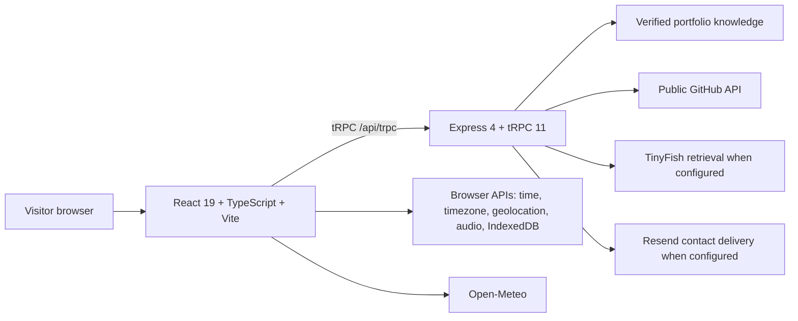

# Developer OS

> A Windows 11-inspired developer portfolio that turns Bharani Kumar S’s verified work, projects, skills, and public developer presence into an interactive desktop experience for the web.

[](https://github.com/vincenzo-afk/Developer-OS/actions/workflows/ci.yml)
[](LICENSE)

[Repository](https://github.com/vincenzo-afk/Developer-OS) · [Report a bug](https://github.com/vincenzo-afk/Developer-OS/issues/new?template=bug_report.yml) · [Request a feature](https://github.com/vincenzo-afk/Developer-OS/issues/new?template=feature_request.yml) · [Contributing](CONTRIBUTING.md)

## Contents

- [Overview](#overview)
- [Features](#features)
- [Architecture](#architecture)
- [Technology](#technology)
- [Getting started](#getting-started)
- [Configuration](#configuration)
- [Usage](#usage)
- [Project structure](#project-structure)
- [Testing and CI](#testing-and-ci)
- [Deployment](#deployment)
- [Contributing](#contributing)
- [Security](#security)
- [License](#license)

## Overview

Developer OS is a public portfolio application for **Bharani Kumar S** ([`vincenzo-afk`](https://github.com/vincenzo-afk)). It uses familiar desktop conventions—an unlock screen, taskbar, Start menu, windows, Explorer, Settings, and an Edge-inspired browser—to make a verified portfolio record easier to explore.

> Developer OS is a web application inspired by Windows desktop interaction patterns. It is not an operating system and is not affiliated with Microsoft.

The source of truth for the portfolio profile, repository record, technologies, social links, and achievements is [`client/src/lib/portfolioData.ts`](client/src/lib/portfolioData.ts). The application deliberately avoids fabricated portfolio metrics, testimonials, project claims, or live values. When an external source cannot be reached, the interface presents an honest loading, unavailable, or fallback state.

## Features

| Area | Implemented behavior |
|---|---|
| Desktop shell | Unlock screen, draggable, minimizable and maximizable windows, taskbar, Start menu, task view, snap layouts, system tray, context menu, keyboard controls, and optional sound feedback. |
| Portfolio workspace | Verified profile data, repositories, technology stack, achievements, social links, and project navigation. |
| Windows Search | **Ctrl/Cmd + K** opens a keyboard-accessible search surface for installed applications and verified repository records. |
| Explorer | Sortable list/grid/detail views with selected project details, bounded recent projects, locally pinned projects, and an explicit workspace reset. |
| Edge-inspired browser | Direct URL/search entry, supported YouTube navigation, local bookmarks/history, and bounded restorable tabs. External destinations that do not allow embedding remain honest hand-offs. |
| Terminal | Safe navigation aliases: `open <verified project>` routes to the browser workspace, while `explore <verified project>` selects the record in Explorer. It does not execute visitor commands. |
| Personalization | Local wallpaper image, video, or URL choices; accent, theme, taskbar, icon-size, text-size, sound, and motion preferences. |
| Live information | Browser-local time and timezone, public GitHub data, opt-in geolocation, and Open-Meteo weather with explicit unavailable states. |
| Portfolio Assistant | Fact-grounded answers from the verified local record, public GitHub retrieval, optional TinyFish search retrieval, cited evidence, and a fallback when generation is unavailable. |
| Contact delivery | Validated, rate-limited Resend contact delivery with the visitor’s address set only as `Reply-To`. |

## Architecture



The local development runtime starts the project server through `server/_core/index.ts`. The Vercel integration reuses `server/app.ts` through `api/index.ts` and `api/[...path].ts`, keeping serverless API routing separate from the Vite client build.

## Technology

| Layer | Verified technologies |
|---|---|
| Frontend | React 19, TypeScript 5.9, Vite 7, Tailwind CSS 4, Radix UI, Wouter, TanStack Query, Framer Motion. |
| Backend | Node.js, Express 4, tRPC 11, Zod, SuperJSON. |
| Data and persistence | Drizzle ORM, MySQL-compatible database support, browser `localStorage`, and IndexedDB for visitor personalization. |
| Integrations | GitHub public API, Open-Meteo, Resend, TinyFish, and optional Manus platform services in the managed runtime. |
| Tooling | pnpm, Vitest, jsdom, TypeScript, esbuild, Prettier. |
| Deployment | Vercel configuration for Vite output plus Express-backed API functions. |

## Getting started

### Prerequisites

- Node.js **22** or newer.
- pnpm **10** or newer.
- A Resend account and verified sending domain only if enabling production contact delivery.
- Optional service credentials for TinyFish, database, authentication, or a non-managed LLM provider depending on the features deployed.

### Install and run

```bash
git clone https://github.com/vincenzo-afk/Developer-OS.git
cd Developer-OS
pnpm install
pnpm dev
```

The development server prints the local URL after it starts.

### Validate locally

```bash
pnpm check
pnpm test
pnpm build
```

`pnpm check` runs TypeScript without emitting files. `pnpm test` runs the Vitest suite. `pnpm build` produces the Vite client build and bundles the Node server entry.

## Configuration

Do not commit `.env`, `.env.local`, service tokens, or sender credentials. For a hosted installation, configure secrets in the host’s encrypted environment-variable settings.

| Variable | Purpose | Exposure |
|---|---|---|
| `RESEND_API_KEY` | Authenticates server-side contact delivery. | Server only |
| `RESEND_FROM_EMAIL` | Resend-verified sender identity for the contact form. | Server only |
| `RESEND_TO_EMAIL` | Destination inbox for submitted contact messages. | Server only |
| `TINYFISH_API_KEY` | Enables optional cited live-web retrieval for the assistant. | Server only |
| `DATABASE_URL` | Enables database-backed template features. | Server only |
| `JWT_SECRET` | Supports session/authentication infrastructure. | Server only |
| `VITE_APP_ID`, `OAUTH_SERVER_URL`, `VITE_OAUTH_PORTAL_URL` | Required only when enabling the managed OAuth flow on the target host. | Host-specific |

The managed Manus runtime may supply `BUILT_IN_FORGE_API_URL` and `BUILT_IN_FORGE_API_KEY`; those values are platform-managed and should not be copied into a different host. On Vercel, configure an independent LLM provider if generative Assistant responses are required. Verified local answers and retrieval-based fallbacks remain available when a generative provider is unavailable.

For the exact Vercel notes, including serverless API routing and environment scoping, see [VERCEL_DEPLOYMENT.md](VERCEL_DEPLOYMENT.md).

## Usage

The application is designed to be explored like a small desktop environment. Unlock the desktop, open an app from the Start menu or desktop, then use the taskbar and task view to move between open workspaces.

| Action | Result |
|---|---|
| **Ctrl/Cmd + K** | Opens Windows Search for installed apps and verified repositories. |
| Search result: application | Opens or focuses the selected desktop application. |
| Search result: repository | Sends the verified project record to the Edge-style browser workspace. |
| `open <project>` in Terminal | Opens the verified project in the browser workspace. |
| `explore <project>` in Terminal | Selects the verified project in Explorer. |
| Explorer **Reset workspace** | Removes browser-local recent and pinned project references. |

Local personalization and workspace history remain in the visitor’s browser. They do not change the public portfolio dataset or write visitor wallpaper files to the repository.

## Project structure

```text
Developer-OS/
├── api/                         # Vercel serverless entry points
├── client/
│   └── src/
│       ├── components/           # Portfolio, system, and UI components
│       ├── lib/                  # Desktop workspace, personalization, data, and interaction helpers
│       └── pages/Home.tsx        # Main desktop shell
├── drizzle/                      # Database schema and migrations
├── server/
│   ├── app.ts                    # Shared Express application factory
│   ├── routers.ts                # tRPC procedures
│   ├── assistantRetrieval.ts     # GitHub and TinyFish evidence retrieval
│   └── portfolioKnowledge.ts     # Verified assistant knowledge corpus
├── shared/                       # Shared tRPC contracts and types
├── VERCEL_DEPLOYMENT.md          # Hosting configuration notes
├── vercel.json                   # Vercel routing and build configuration
└── package.json                  # Scripts and dependency manifest
```

## Testing and CI

The Vitest suite covers desktop workspace persistence, search and routing behavior, window interactions, data fallbacks, assistant retrieval/fallback behavior, contact configuration, and other deterministic helpers.

GitHub Actions runs the following workflow on pushes and pull requests targeting `main`:

```bash
pnpm install --frozen-lockfile
pnpm check
pnpm test
pnpm build
```

The workflow uses read-only repository permissions and does not deploy or expose secrets.

## Deployment

Developer OS includes a Vercel configuration for a Vite client build and Express-backed API functions. A static-only host can render the desktop interface, but it cannot safely deliver Resend email or protect server-side provider credentials.

1. Import `vincenzo-afk/Developer-OS` into a Node-compatible host such as Vercel.
2. Configure the required encrypted environment variables for the features you intend to enable.
3. Use `pnpm build` as the build command.
4. Confirm the deployed `/api/trpc` endpoints are reachable before advertising assistant or contact capabilities.

The repository does not currently publish a permanent production URL in this document. Add one only after the linked deployment has completed successfully.

## Contributing

Contributions are welcome when they preserve the project’s truthful-data boundary and Windows desktop interaction model. Please read [CONTRIBUTING.md](CONTRIBUTING.md) before opening an issue or pull request.

## Security

For a private vulnerability report, follow [SECURITY.md](SECURITY.md). Do not post credentials, access tokens, email keys, or security-sensitive reproduction details in public issues.

## License

Developer OS is released under the [MIT License](LICENSE).

---

Built and maintained by [Bharani Kumar S (`vincenzo-afk`)](https://github.com/vincenzo-afk).
